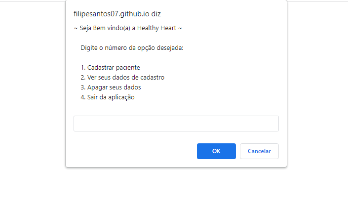

# NLW eSports 

> Trilha Explorer

Colocando em prática todo o aprendizado adiquirido até o momento no stage 04 trilha Explorer - Rocketseat. Com os ensinamentos do Maykão eu consegui desenvolver esse simples menu de cadastro interativo. O paciente pode fazer o seu cadastro digitando 1, ver seus dados de cadastro digitando 2(caso não exista nenhum cadastro, aparecerá um alerta informando que não há dados cadastrados), digitando o número 3 o paciente poderá apagar os seus dados de cadastro(caso não haja dados cadastrados aparecerá um alerta informando que não há dados a serem apagados) e por fim o usuário poderá sair da aplicação digitando o número 4. De verdade eu tou muito feliz com minha evolução em lógica de programação e algoritmos, as coisas estão começando a fazer sentido.

[🔗 Clique aqui para acessar](https://filipesantos07.github.io/Cadastrando-um-paciente-e-interagindo-com-ele/)

## 🛠️ Tecnologias

- HTML
- JavaScript

## 💛 Contato

FilipeSantosEstudos1@gmail.com